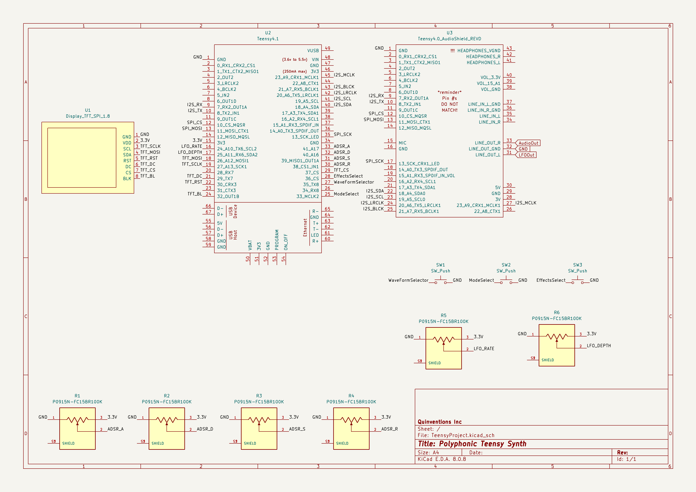

# Teensy Synth Project

A polyphonic USB MIDI synthesizer featuring analog signal processing, built using the Teensy 4.1 microcontroller.

---

## 🚀 Overview

The **Teensy Synth Project** is a powerful and portable synthesizer leveraging the Teensy 4.1 for real-time polyphonic audio synthesis. This project combines high-quality digital synthesis with analog processing, offering an expressive and customizable musical instrument.

---

## 🎛️ Features

- **8-Voice Polyphony:** Simultaneously play up to 8 notes with dynamic voice allocation.
- **Multiple Modes:** Includes Polyphonic, Snap-Back (monophonic), and Arpeggiator modes.
- **Real-Time Controls:** Adjust ADSR envelope, LFO modulation, waveform selection, and built-in effects via hardware controls.
- **USB MIDI Integration:** Compatible with most USB MIDI controllers.
- **High-Fidelity Audio:** PCM5102A DAC, analog filtering, and effects for professional audio quality.
- **Visual Feedback:** Integrated TFT display shows waveform type, ADSR envelope, and LFO settings.

---

## 🛠️ Getting Started

### Prerequisites

- [Arduino IDE](https://www.arduino.cc/en/software) with [Teensyduino](https://www.pjrc.com/teensy/td_download.html)
- [VSCode](https://code.visualstudio.com/) with Arduino extension (optional but recommended)
- Required libraries:
  - Teensy Audio Library
  - USBHost_t36 Library
  - Adafruit GFX Library
  - Adafruit ST7735 Library

### Installation & Setup

1. **Clone the repository:**

   ```bash
   git clone https://github.com/yourusername/Teensy-Synth-Project.git
   cd Teensy-Synth-Project
   ```

2. **Hardware Assembly:**
   - Consult the `Hardware/Schematics/` folder for circuit diagrams.
   - Assemble hardware components according to provided schematics and PCB layouts.

3. **Software Installation:**
   - Open the `Synthesizer.ino` file located in `Software/` in Arduino IDE.
   - Set board type to `Teensy 4.1`.
   - Install required libraries through Arduino Library Manager.
   - Upload the sketch to the Teensy 4.1.

---

## 🎚️ Usage

- **Mode Button:** Switch between Polyphonic, Snap-back, and Arpeggiator modes.
- **Waveform Button:** Cycle through available waveform types (Sine, Square, Triangle, Sawtooth).
- **Effect Button:** Enable or disable the global delay effect.
- **Potentiometers:** Adjust Attack, Decay, Sustain, Release (ADSR envelope) and LFO parameters in real-time.
- **Display:** TFT screen displays current mode, waveform type, ADSR envelope, and LFO parameters.

---
## 📜 Circuit Schematic
Below is the **Teensy Synth Project** schematic.  
For the KiCad source files for just the Teensy, check the [`Hardware/PCB_Layouts/teensy_pbc_no_analog`](Hardware/PCB_Layouts/teensy_pbc_no_analog) folder.
For the KiCad project source files, check the [`Hardware/PCB_Layouts/teensy_pbc`](Hardware/PCB_Layouts/teensy_pbc) folder.


[📄 View PDF Version](Hardware/Schematicss/teensy_synth_schematic_no_analog.pdf)

## 🧪 Testing & Results

Detailed test procedures and results are located in the `Test_Results/` directory:

- **MIDI Latency Tests:** Measured MIDI-to-audio latency (~1.2 ms average).
- **Polyphony Performance:** Verified 8-voice polyphony with stable CPU usage (~55%).
- **Audio Quality Tests:** Confirmed THD < 0.01% and SNR > 100 dB.

See the full report in `Documentation/Final_Report.md`.

---

## 🤝 Contributing

Contributions and suggestions are welcome:

1. Fork the repository.
2. Create your feature branch:
   ```bash
   git checkout -b feature/my-feature
   ```
3. Commit your changes:
   ```bash
   git commit -m 'Add my feature'
   ```
4. Push to your branch:
   ```bash
   git push origin feature/my-feature
   ```
5. Open a Pull Request describing your changes clearly.

---


## 🌟 Acknowledgements

- Teensy Documentation
- Teensy Audio Library
- Adafruit GFX Library
- Adafruit ST7735 Library
- USB MIDI Specification

---

## 🔮 Future Enhancements

- Additional audio effects (reverb, chorus, phaser)
- Advanced modulation capabilities
- Expanded visualizations and UI improvements on the TFT display
- Optimization for increased polyphony (more than 8 voices)

---


